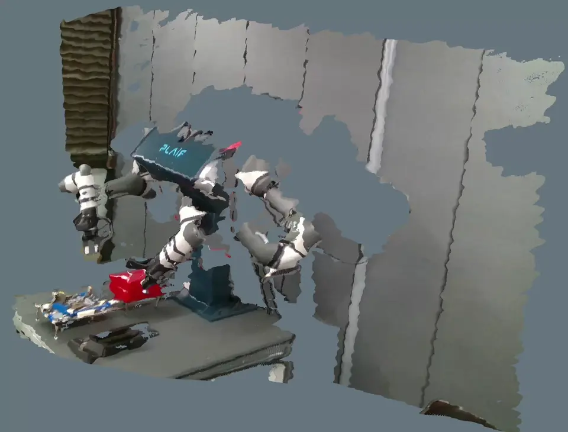
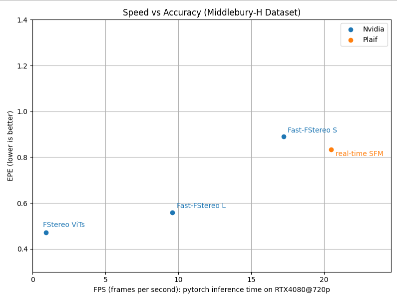

# Real-Time Stereo Foundation Model

[](https://github.com/plaif/lib-sfm/releases)
[](https://releases.ubuntu.com/22.04/)
[](https://en.cppreference.com/w/cpp/17)
[](https://developer.nvidia.com/cuda-toolkit)
[](https://developer.nvidia.com/cudnn)
[](https://developer.nvidia.com/tensorrt)

This repository contains a real-time stereo foundation model designed to improve stereo depth quality at high speed. After optimization, the model is calculated to run at **36 FPS at 720p on an RTX 4080**.

At a high level, stereo depth estimation works by comparing the left and right images of the same scene and finding matching visual regions between them. The horizontal shift between those matches, often called disparity, is then used to estimate depth: larger shifts usually correspond to closer objects, while smaller shifts correspond to farther objects. This model follows that same basic stereo principle, but uses a foundation-model-based approach to produce higher-quality depth more robustly and at real-time speed.

## Model Flow

The diagram below shows the overall model flow.


## Inputs and Outputs

The model takes a left-right stereo image pair as input and predicts dense stereo depth. For best results, the input pair should be **stereo-rectified**, spatially aligned, and captured at the same resolution. In practical use, the left and right images should come from a calibrated stereo rig so the camera intrinsics and stereo baseline are known when metric depth is required.

In this repository, the example pipeline uses `left.png` and `right.png` as the required stereo inputs, with optional `rgb.png` for colorizing the output point cloud. The generated outputs include a raw depth map in millimeters, a colorized depth preview, and a colored point cloud.

The animated preview below shows a visual comparison between a traditional stereo method and our AI-based stereo model.




## Performance

The graph below shows the speed-accuracy tradeoff of this model family compared with NVIDIA stereo models.



This model family is designed to improve runtime efficiency while maintaining practical stereo depth quality. In general, the faster variants reduce inference cost so they can run at higher speed, while still preserving moderate performance rather than collapsing in accuracy. This makes the model suitable for real-time applications where both latency and depth quality matter, and where a balanced tradeoff is often more useful than pursuing maximum accuracy alone.

Within the family, the larger foundation model emphasizes stronger accuracy, while the fast variants shift the design toward lower computational cost and faster execution. The result is a set of models that span different operating points, allowing users to choose between higher quality or higher speed depending on deployment constraints.

In the graph:

- **FStereo ViTs** denotes **Foundation Stereo**.
- **Fast-FStereo L** denotes the **best-accuracy version** of the Fast Foundation Stereo model.
- **Fast-FStereo S** denotes the **best-speed version** of the Fast Foundation Stereo model.

For fair comparison, the speed shown in this graph reflects **PyTorch inference speed before optimization**. Actual speed varies depending on hardware and stereo image size.


## Customer Examples for libSFM

Sample integrations for consumers of the `libsfm` Debian package.
Each language binding lives in its own top-level directory so they can be
copied, built, and distributed independently.

```
lib-sfm/
├── README.md            # you are here
├── cpp/                 # C++ example (OpenCV)
│   ├── CMakeLists.txt
│   ├── README.md
│   └── src/stereo_example.cpp
├── python/              # Python example (pysfm + OpenCV)
│   ├── README.md
│   └── stereo_example.py
├── input/               # supply your own frames here
│   ├── left.png         #   left  IR  (required)
│   ├── right.png        #   right IR  (required)
│   └── rgb.png          #   color frame (optional — enables colored PLY)
└── output/              # example outputs land here (gitignored)
```

The C++ example under [`cpp/`](cpp/README.md) and the Python example under
[`python/`](python/README.md) share the same `input/` and `output/` layout —
both read the IR pair (and optional color frame) and produce a depth map plus
a colored PLY file.

For Python consumers we ship a self-contained wheel (`pysfm`) that bundles
`libsfm.so` beside the extension module — **no Debian package install is
required to use the Python binding**. See [Python package (pysfm)](#python-package-pysfm)
below.

## Prerequisites

libSFM ships as a Debian package on Ubuntu 22.04. Install the package
yourself, then make sure the supporting libraries below are present before
building any example.

| Category              | Packages                                                    |
|-----------------------|-------------------------------------------------------------|
| libSFM                | `libsfm`, `libsfm-dev`                                      |
| NVIDIA runtime        | CUDA Toolkit 12.9, cuDNN 9.10.x, TensorRT 10.12.x           |
| C++ build tooling     | `build-essential`, `cmake ≥ 3.20`                           |
| C++ example deps      | `libopencv-dev`                                             |

> 📦 For detailed installation and verification steps, see [INSTALL.md](INSTALL.md).
## Manual runtime setup for NVIDIA libraries installed from Tarballs

If you installed CUDA, cuDNN, or TensorRT from `.tar` archives instead of
system packages, your shell may not know where to find the binaries and shared
libraries. In that case, set the runtime paths manually before building or
running the examples.

The equivalent Docker-style `ENV` settings are:

```Dockerfile
ENV PATH="/usr/local/bin:/usr/local/cuda/bin:${PATH}"
ENV LD_LIBRARY_PATH="/usr/local/cuda/lib64:/usr/local/tensorrt/lib:${LD_LIBRARY_PATH}"
ENV LD_LIBRARY_PATH="/usr/local/tensorrt/targets/x86_64-linux-gnu/lib:${LD_LIBRARY_PATH}"
```

is to run these commands in your terminal:

```bash
export PATH="/usr/local/bin:/usr/local/cuda/bin:${PATH}"
export LD_LIBRARY_PATH="/usr/local/cuda/lib64:/usr/local/tensorrt/lib:${LD_LIBRARY_PATH}"
export LD_LIBRARY_PATH="/usr/local/tensorrt/targets/x86_64-linux-gnu/lib:${LD_LIBRARY_PATH}"
```

If `libsfm.so`, TensorRT, or cuDNN fail to load at runtime, check
`LD_LIBRARY_PATH` first. The extra
`/usr/local/tensorrt/targets/x86_64-linux-gnu/lib` entry was required during
troubleshooting when TensorRT had been unpacked from a tarball.

## Supported GPUs

The distributed `libsfm.so` is compiled for compute capability **7.5 / 8.6 / 8.9**
(Turing, Ampere, Ada Lovelace). Other architectures require a rebuild — contact
PLAIF if needed.

## Supported resolutions

The following input resolutions are supported:

| Resolution  | Aspect ratio | Pixels   |
|-------------|--------------|----------|
| 640 × 360   | 16:9         | 0.23 MP  |
| 640 × 480   | 4:3          | 0.31 MP  |
| 1280 × 720  | 16:9         | 0.92 MP  |
| 1920 × 1080 | 16:9         | 2.07 MP  |

## Verified environments

Stable operation has been confirmed on the OS / kernel / driver combinations
below. Other combinations may also work but are not officially verified.

| Arch    | OS              | Kernel              | NVIDIA driver | GPU             |
|---------|-----------------|---------------------|---------------|-----------------|
| x86_64  | Ubuntu 22.04.5  | 6.8.0-107-generic   | 575.64.03     | RTX 5060        |
| x86_64  | Ubuntu 22.04.5  | 5.15.0-174-generic  | 580.95.05     | RTX 4070 Super  |

## First-run TensorRT engine build

On the first run (and whenever the GPU, driver, or TensorRT version changes),
libSFM compiles and serializes a TensorRT engine for your hardware. **Expect
at least ~20 minutes** of startup time for this step; exact duration depends on
your CPU, GPU, driver, and TensorRT version, and can be noticeably longer on
slower machines. Subsequent runs reuse the cached engine and start in seconds.

## Unit convention

The libSFM public API is millimeter-uniform. Baselines, extrinsic translations,
depth values, and point-cloud xyz are all in **mm**. When bridging to
RealSense or other meter-based sources, multiply translations by 1000 at the
boundary. See the `sfm` README for details.

## Python package (pysfm)

`pysfm` wraps the libSFM public API (`SFMProcess`, `Intrinsic`, `Extrinsic`,
`ColorCamera`) with pybind11. The wheel bundles `libsfm.so` beside the
extension module and loads it via `$ORIGIN` RPATH, so installing the Debian
`libsfm` package is **not** required when you only use the Python binding.

### Wheel artifact

| File | Target |
|---|---|
| `pysfm-1.0.0-cp310-cp310-linux_x86_64.whl` | Ubuntu 22.04 · x86_64 · CPython 3.10 |

### Install

```bash
pip install numpy
pip install pysfm-1.0.0-cp310-cp310-linux_x86_64.whl
```

Optional extras pull in demo dependencies:

```bash
pip install "pysfm[opencv]"     # + opencv-python
pip install "pysfm[open3d]"     # + open3d
pip install "pysfm[realsense]"  # + pyrealsense2
```

The NVIDIA stack (CUDA 12.9, cuDNN 9.10.x, TensorRT 10.12.x) and the same
`libcurl4 / libssl3 / libfmt8` apt line documented under **Prerequisites**
must be present on the host.

- **apt / `.deb`** installs of CUDA/cuDNN/TensorRT: nothing extra needed.
- **tar / runfile** installs: run `ldconfig` once for the CUDA and TensorRT
  lib directories (see the
  [Manual runtime setup for tar installs](#manual-runtime-setup-for-tar-installs)
  section above).
- **pip wheel** NVIDIA stacks (`nvidia-*-cu12`, `tensorrt-cu12`): `pysfm`'s
  preload hook `dlopen`s the libraries with `RTLD_GLOBAL` automatically.
  TensorRT's builder still requires the `tensorrt_libs` directory on
  `LD_LIBRARY_PATH`:
  ```bash
  export LD_LIBRARY_PATH="$(python -c 'import os, tensorrt_libs; print(os.path.dirname(tensorrt_libs.__file__))')":$LD_LIBRARY_PATH
  ```

Set `PYSFM_DEBUG_PRELOAD=1` to trace which NVIDIA libraries were resolved,
or `PYSFM_EXTRA_LIB_DIRS=/a:/b` to extend the probe list.

### Minimal usage

```python
import numpy as np
import pysfm

sfm = pysfm.SFMProcess.instance()
sfm.initialize(gpu_id=0)

K = pysfm.Intrinsic(fx=640., fy=640., cx=640., cy=360.)
ir_l = np.zeros((720, 1280, 3), dtype=np.uint8)
ir_r = np.zeros_like(ir_l)

out = sfm.infer(ir_l, ir_r, K, baseline_mm=55.0,
                want_depth=True, want_pointcloud=True)
depth  = out["depth"]    # float32 (H, W), millimeters
points = out["points"]   # float64 (N, 3), mm
colors = out["colors"]   # float64 (N, 3), [0, 1]

sfm.finalize()
```

`SFMProcess.infer` releases the GIL and is internally serialized, so the
singleton is safe to share across Python threads. `initialize` / `finalize`
are one-shot per process.

A runnable end-to-end example that mirrors the C++ sample (reads
`input/left.png`, `input/right.png`, optional `input/rgb.png`, writes depth
images and a colored PLY under `output/`) lives in
[`python/`](python/README.md).

### contact
## Licensing & Purchase

libSFM is distributed as a commercial library. To obtain a license, follow the steps below.

### 1. Contact Us

Send a purchase inquiry to **[khkim@plaif.com](mailto:khkim@plaif.com)** with the following information:

- Your name and organization
- Intended use case and deployment environment
- Expected number of devices or instances

> **Note:** Our team will review your inquiry and follow up regarding licensing options, pricing, and any additional requirements.

### 2. Receive Your License Key

Once your purchase is approved, an activation key will be sent to the email address provided during the inquiry.

### 3. Configure Your Environment

Update your `.env` file with the provided activation key and the latest model weight filename:

```env
SFM_LICENSE_KEY=your-activation-key-here
SFM_WEIGHT_FILE=your-weight-filename-here
```

After saving the file, the library will automatically validate your license and load the specified weights on initialization.
